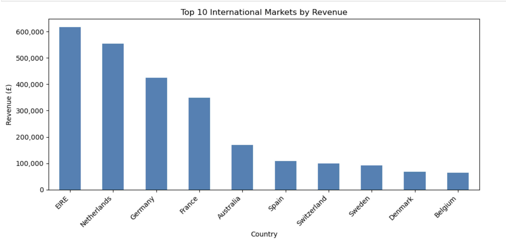
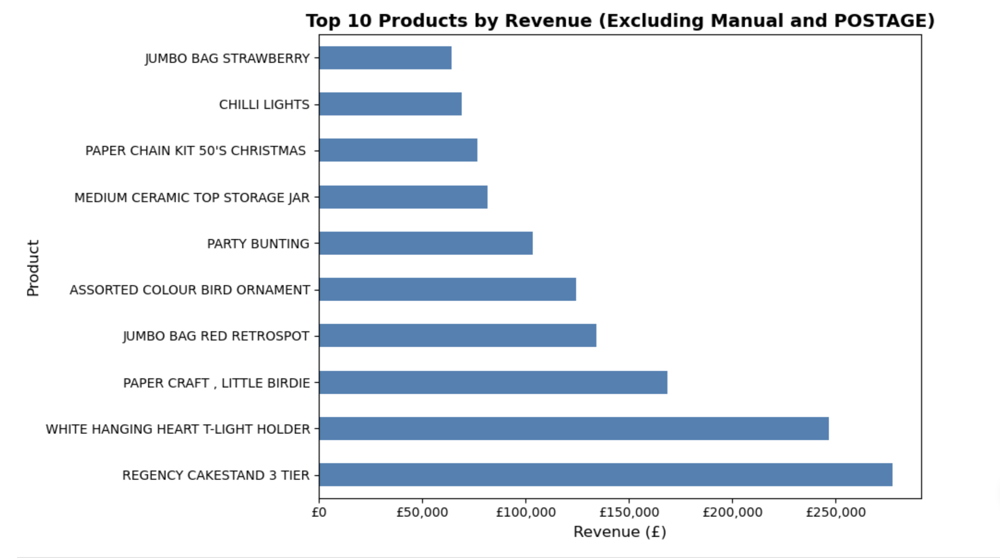
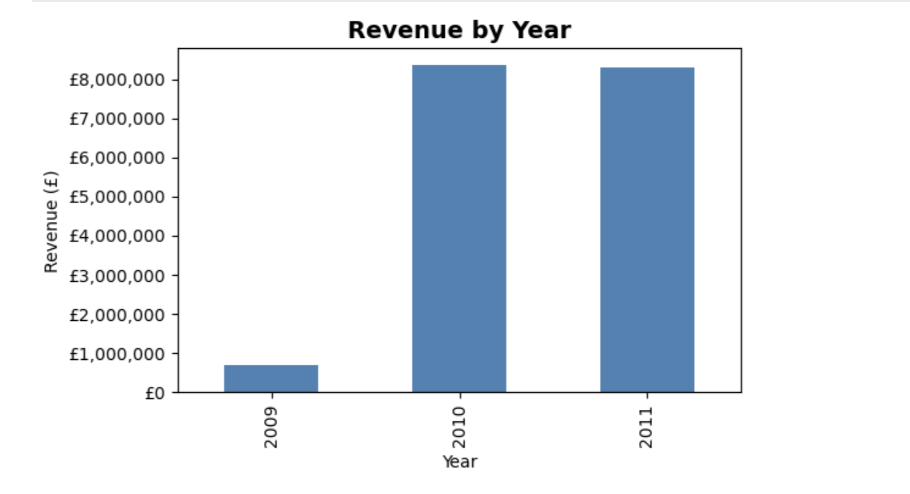
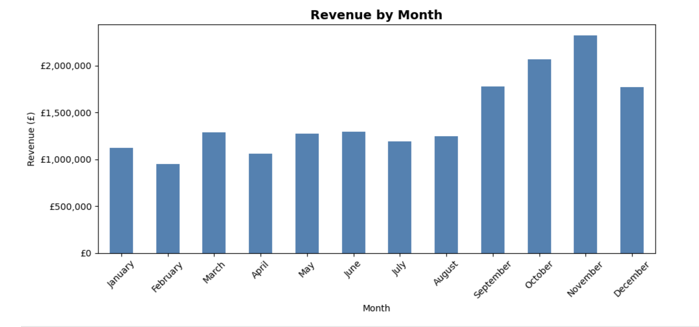
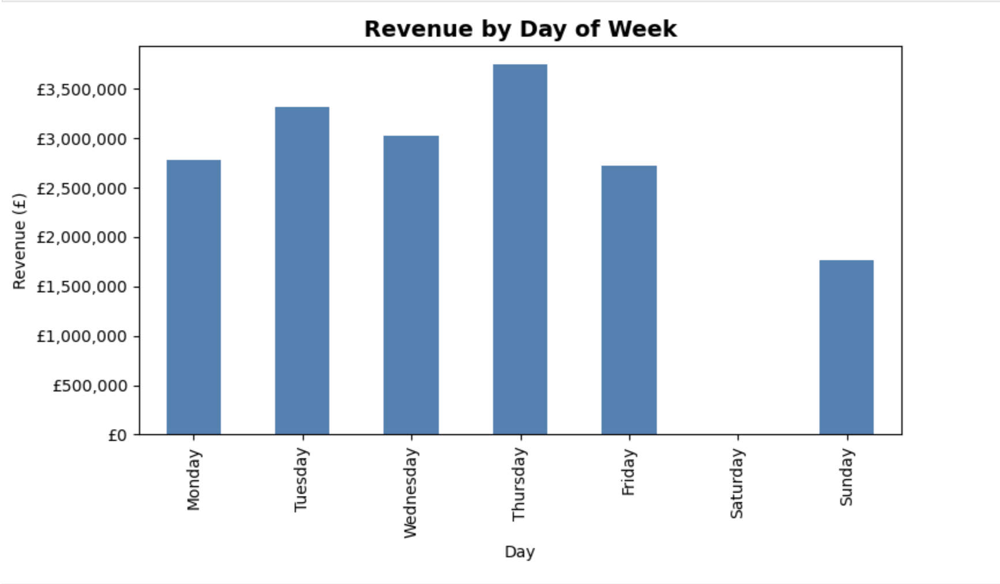
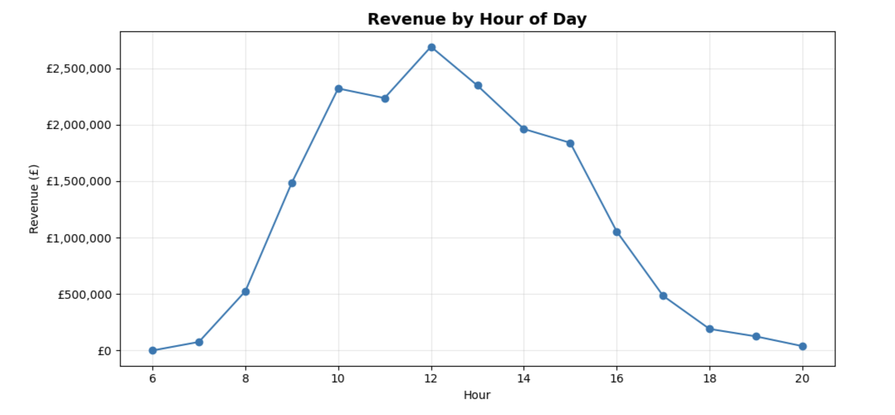
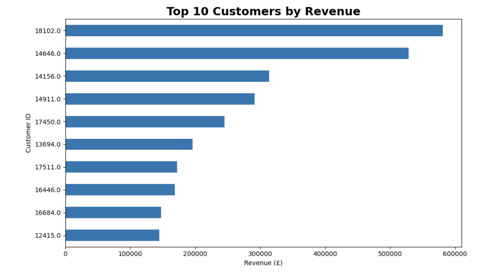

# Online Retail Sales Analysis

End-to-end exploratory data analysis (EDA) of over **1 million online retail transactions** using **Python, Pandas, and Matplotlib** to uncover customer purchasing behavior, product performance, revenue trends, and business insights.

---

## Project Overview

This project analyzes transactional data from a UK-based online retail company between **December 2009 and December 2011**. The objective is to transform raw sales data into actionable business insights that can support data-driven decision-making.

Key areas of analysis include:

- Revenue performance
- Top-performing products
- Customer purchasing behavior
- Geographic sales distribution
- Seasonal and time-based trends

---

## Business Questions

This analysis answers the following business questions:

1. How much revenue did the business generate?
2. Which countries generate the most revenue?
3. Which products generate the most revenue?
4. How does revenue change over time?
5. Who are the highest-value customers?

---

## Dataset

**Dataset:** Online Retail II

- Over **1,000,000 transactions**
- Period: December 2009 – December 2011
- Source:
  https://archive.ics.uci.edu/ml/datasets/Online+Retail+II

The dataset contains:

- Invoice number
- Product code
- Product description
- Quantity purchased
- Invoice date
- Unit price
- Customer ID
- Country

---

## Data Cleaning

The original dataset required extensive preprocessing before analysis.

### Data Quality Checks

- Investigated missing Customer IDs
- Investigated missing Product Descriptions
- Examined negative quantities
- Identified cancelled transactions
- Removed duplicate records

### Cleaning Decisions

- Removed rows with missing Customer IDs
- Removed rows with missing Descriptions
- Removed cancelled/returned transactions
- Removed negative quantities
- Removed duplicate rows
- Created a Revenue column

```python
Revenue = Quantity × Price
```

### Final Dataset

- **779,425 clean transactions**
- No missing values
- No duplicate rows
- No negative quantities

---

## Key Findings

### Revenue

- **Total Revenue:** **£17.37 million**
- **Average Order Value:** **£469.98**

---

### Top Markets

The United Kingdom generated the largest share of revenue.

Top international markets include:

- EIRE
- Netherlands
- Germany
- France
- Australia

---

### Best-Selling Products by Revenue

After excluding non-product categories such as **Manual** and **POSTAGE**, the highest revenue-generating products were:

1. REGENCY CAKESTAND 3 TIER
2. WHITE HANGING HEART T-LIGHT HOLDER
3. PAPER CRAFT, LITTLE BIRDIE
4. JUMBO BAG RED RETROSPOT
5. ASSORTED COLOUR BIRD ORNAMENT

Further analysis showed that some products generated high revenue because of **large sales volume**, while others benefited from **higher average selling prices**.

---

### Revenue Trends

Revenue analysis revealed:

- Peak sales during **October–December**
- **November** generated the highest monthly revenue
- Revenue peaked around **midday (12 PM)**
- **Thursday** was the strongest sales day

These findings suggest strong seasonal demand leading into the holiday shopping period.

---

### Customer Analysis

Top customers contributed a significant portion of total revenue.

The **Top 10 customers generated approximately 16% of total revenue**, indicating that a relatively small group of customers contributes disproportionately to overall sales.

---

## Technologies Used

- Python
- Pandas
- NumPy
- Matplotlib
- Jupyter Notebook

---

## Project Structure

```
online-retail-sales-analysis/
│
├── Online_Retail_Sales_Analysis.ipynb
├── README.md
├── requirements.txt
├── images/
│   ├── top_countries.png
│   ├── top_products.png
│   ├── revenue_by_month.png
│   ├── revenue_by_day.png
│   ├── revenue_by_hour.png
│   ├── top_customers.png
│   └── customer_share.png
└── data/
```

---

## Sample Visualizations

### Top International Markets



### Top Revenue-Generating Products



### Revenue by Year



### Revenue by Month



### Revenue by Day



### Revenue by Hour



### Top Customers



---

## Future Improvements

Potential future work includes:

- Customer segmentation (RFM analysis)
- Customer Lifetime Value (CLV)
- Cohort retention analysis
- Market basket analysis
- Interactive Tableau or Power BI dashboard

---

## 👤 Author

**Dilly Nguyen**

- LinkedIn: www.linkedin.com/in/dilly1109
- GitHub: https://github.com/dillyy1109
